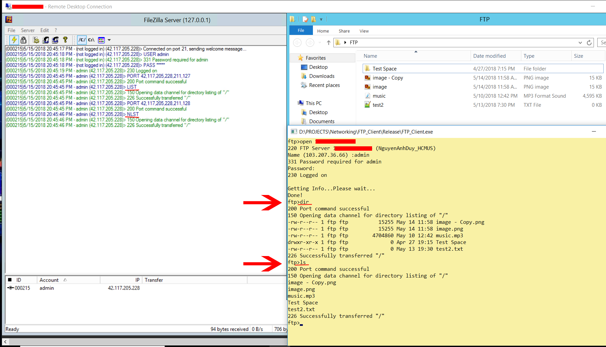
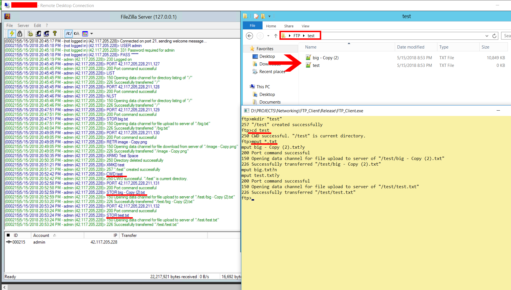
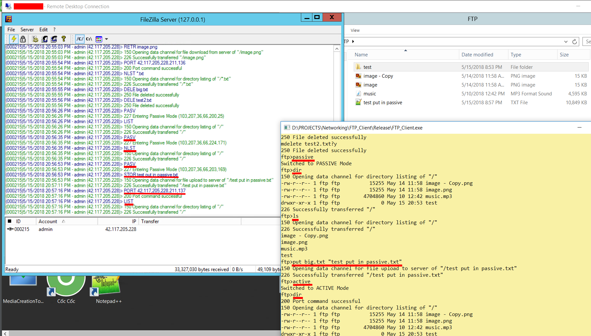

# FTP_Client
A command-line console application for FTP Connection from Client-side which supports PASSIVE Mode (default FTP of Windows doesn't). 
This application does not use any additional libraries except C++'s standard ones.
## Getting Started
### How to Use
Just download or clone the repo then run EXE file in Release.rar. 

You can edit the source code files then build with Visual Studio for the same result.

### Coding Structures
Commands were not handled separately, but divided into 4 groups based on their structures (sequences of command send to server) :

**1. Commands which not related to PORT commands (DELETE, CD, MKDIR, RMDIR).**

**2. Commands which related to PORT commands (DIR, LS, PUT, GET).**

**3. Commands which handled multiple files at once (MDELETE, MGET, MPUT). These commands would call to their sub-commands (ex. MPUT calls PUT).**

**4. Other commands (LCD, PWD, PASSIVE).**

All classes, fields, methods are fully commented before their declarations. Check source code if you want further detail.

### Supported Commands & Features
**1. DIR, LS**         

**2. PUT, MPUT**       

**3. GET, MGET**      

**4. DELETE, MDELETE**    

**5. MKDIR, RMDIR** 

**6. CD, LCD, PWD**

**7. PASSIVE, ACTIVE**

### Screenshots 
For full list of screenshots, please check in Screenshots folder!

## Tech/framework used
**1. Winsock & CSocket for establishing connections to server.**

**2. Regular Expression (Regex) for matching ip address's format, parameters' format...**

## References
All information about this project's process can be found at my [TrelloBoard](https://trello.com/b/TjAkykqs/ftpclient)

Please create new issue if you face any problems/bugs in my code and I will fix it as soon as possible. Thanks for your contribution.
